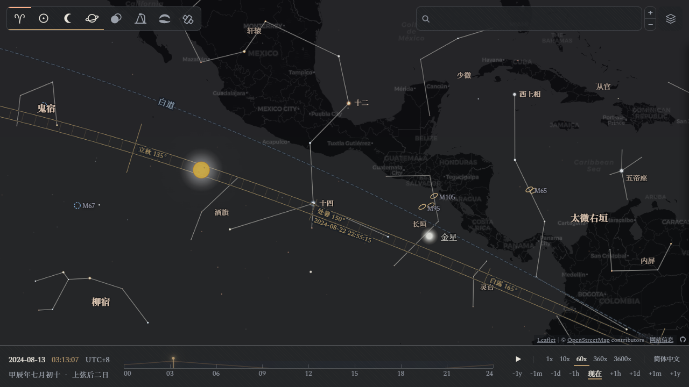
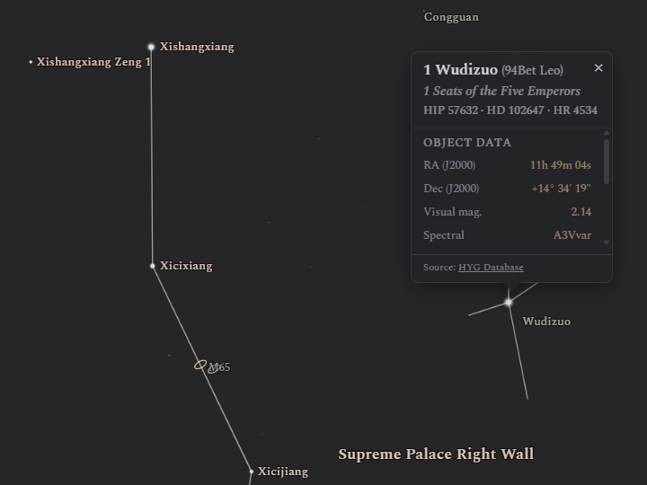
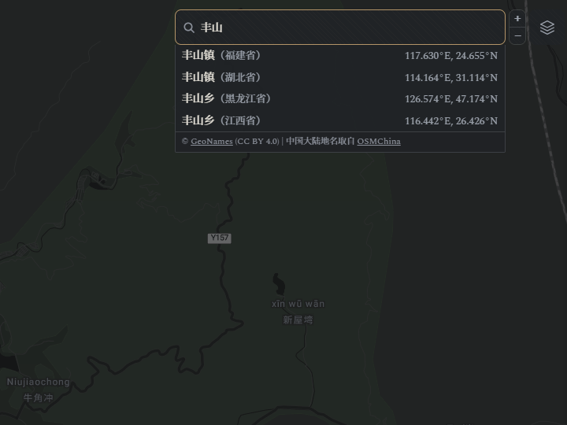

#  Substellar Atlas

[简体中文](../zh-Hans/README.md) · [繁體中文](../zh-Hant/README.md) · [English](../en/README.md) · **Français** · [Español](../es/README.md) · [Italiano](../it/README.md) · [日本語](../ja/README.md)

<p align="center">
  
</p>

**Site web** : https://higashimado.github.io/SubstellarAtlas/

Substellar Atlas est une visualisation construite sur le concept du *point substellaire*. La sphère céleste est projetée sur la surface de la Terre, et les deux sont superposées. Sur cette carte, chaque corps céleste se trouve à l'emplacement géographique de son point substellaire, dérivant avec la Terre et tournant lentement avec une période de 23 h 56 min. L'interaction du ciel et de la Terre révèle naturellement où chaque type d'événement astronomique est visible à travers le globe : jour et nuit, planètes, objets du ciel profond, éclipses, aurores, satellites artificiels, et plus encore.

## Concept

> 仲春春分，夕出郊奎、娄、胃东五舍，为齐；仲夏夏至，夕出郊东井、舆鬼、柳东七舍，为楚；仲秋秋分，夕出郊角、亢、氐、房东四舍，为汉；仲冬冬至，晨出郊东方，与尾、箕、斗、牵牛俱西，为中国。—— 《史记·天官书》
>
> *— Sima Qian, Mémoires historiques, « Traité des offices célestes » (Ier s. av. J.-C.) : selon la loge lunaire près de laquelle Mercure apparaît aux équinoxes et aux solstices, chaque région du royaume (Qi, Chu, Han, les États du Centre) se voit attribuer son propre quartier du ciel. Une première formulation du fēnyě.*

<p align="center">
  
</p>

Le ciel a ses constellations ; la Terre a ses régions. Relier les phénomènes du ciel aux régions du sol est une idée aussi ancienne que l'astronomie et l'astrologie elles-mêmes : la Chine ancienne associait les vingt-huit loges lunaires aux Neuf Provinces et aux États féodaux à travers le **分野** (*fēnyě*, « allocation de champs »), tandis que dans le monde gréco-romain, Ptolémée proposait des correspondances entre les douze signes du zodiaque et les nations. Certains ont jugé ce schéma tiré par les cheveux, mais il révélait une symétrie et un isomorphisme entre le ciel et la Terre, une correspondance qui a nourri l'imagination et la réflexion de toutes les époques depuis.

La géodésie moderne donne à ce lien une forme rigoureuse : ```lat = Dec, lon = RA − GMST```. Concrètement, un corps projeté verticalement sur la Terre rencontre la surface en son point substellaire, unique et calculable avec exactitude. Comparée à une carte du monde statique, la carte stellaire projetée présente les caractéristiques suivantes :

* **Rotation vers l'ouest** : la carte stellaire tourne avec la sphère céleste sur un jour sidéral, exactement à l'inverse de la rotation propre de la Terre, de sorte que les étoiles dérivent lentement vers l'ouest au-dessus du sol fixe.
* **Est-ouest inversé** : l'observateur regarde la carte stellaire depuis l'extérieur, à l'opposé du regard porté vers le ciel nocturne depuis l'intérieur, de sorte que l'est et l'ouest sont inversés par rapport à l'observation ordinaire.
* **Le plus proche paraît plus grand** : les corps sont dessinés à leur taille apparente, non physique. La Lune, proche de la Terre, occupe une surface bien plus grande que les planètes ou les objets du ciel profond.

## Fonctionnalités

### Couches

La carte de fond utilise un thème sombre : [CARTO Dark Matter](https://github.com/cartodb/basemap-styles) par défaut, avec la possibilité de passer à [Stadia Alidade Smooth Dark](https://docs.stadiamaps.com/map-styles/alidade-smooth-dark/) depuis le sélecteur de couches en haut à droite. Le sélecteur de couches en haut à gauche active les couches de données développées et intégrées par le site :

| Catégorie | Couches |
|---|---|
| Étoiles / Constellations / Xingguan | Étoiles, objets du ciel profond, pluies de météores, constellations / xingguan / astérismes, étiquettes multilingues, lignes de référence des coordonnées |
| Soleil / Lune / Planètes | Rendu des disques, rendu des phases, voiles de lumière solaire / lunaire |
| Éclipses | Liste des événements, zone de visibilité, circonstances locales et diagrammes |
| Pollution lumineuse | Rendu des données (D. J. Lorenz) |
| Ovale auroral | Rendu des données (NOAA SWPC OVATION) |
| Satellites | Rendu des données (CelesTrak) |

### Boussole de l'observateur

La **boussole de l'observateur** est un outil pour lire les azimuts des corps célestes depuis un lieu donné. Un double-clic n'importe où sur la carte la fait apparaître et la verrouille. Lorsque les couches concernées sont activées, une boussole verrouillée peut afficher :
- les directions du lever et du coucher du Soleil, l'azimut actuel du Soleil et sa trajectoire du jour ;
- les directions du lever et du coucher de la Lune, l'azimut actuel de la Lune et sa trajectoire du jour ;
- l'enveloppe annuelle des trajectoires quotidiennes du Soleil ;
- les azimuts actuels des planètes visibles dans le ciel.

Un clic sur une icône ou une étiquette de la boussole étend son **rayon d'azimut**. Lorsque la boussole est affichée, un clic sur le point substellaire d'un corps trace le grand cercle reliant le lieu de l'observateur à ce point. Le panneau d'information à droite donne des renseignements détaillés sur le lieu ainsi que les données d'observation du jour pour le Soleil, la Lune et les planètes ; un clic sur une heure dans le panneau de données mène à cet instant.

<p align="center">
  
</p>

### Interaction avec les éclipses

Pendant une éclipse, la carte affiche les courbes enveloppes préchargées de sa zone de visibilité ainsi que l'anneau enveloppe calculé en temps réel pour la zone de visibilité instantanée. Le panneau de gauche présente la liste des éclipses de 2000 à 2049 ; le panneau de droite présente la prochaine éclipse visible depuis le lieu sélectionné, ainsi que les circonstances locales de toute éclipse en cours.

<p align="center">
  
</p>

Le diagramme d'éclipse de Lune se présente sur un fond de **carte de l'ombre** de la pénombre et de l'ombre de la Terre, montrant le passage de la Lune à travers elles. Le diagramme d'éclipse de Soleil est un **tracé céleste** du Soleil au cours de l'événement. Sous chaque diagramme figurent la hauteur et l'azimut de la Lune ou du Soleil au maximum de l'éclipse et à chaque contact.

<p align="center">
  
  &nbsp;&nbsp;&nbsp;&nbsp;&nbsp;&nbsp;&nbsp;&nbsp;
  
  <br>
</p>

### Voiles de lumière solaire et lunaire

Les couches du Soleil et de la Lune comportent des voiles de lumière qui simulent leurs zones de visibilité. Le voile solaire est constitué de quatre bandes de luminosité constante, correspondant respectivement au plein jour et aux crépuscules civil, nautique et astronomique. Le voile lunaire varie en luminosité selon l'éclat de la Lune : le plus brillant à la pleine Lune, presque invisible près de la nouvelle Lune. Pendant une éclipse de Lune, il prend une teinte rouge rouille qui s'accentue avec la magnitude de l'ombre. Le sélecteur de couches en haut à droite active ou désactive les voiles de lumière.

<p align="center">
  
</p>

### Gravures célestes

Le Soleil, la Lune et les planètes (les corps qui présentent un disque visible) apparaissent sur la carte sous forme d'icônes façon gravure, dans le style des planches gravées que le fabricant d'instruments d'optique et cartographe britannique [John Browning](https://en.wikipedia.org/wiki/John_Browning_(scientific_instrument_maker)) a publiées dans les *Monthly Notices of the Royal Astronomical Society* en 1870. Chaque disque sous-tend exactement son diamètre apparent sur la carte et varie donc avec la distance du corps à la Terre ; l'ombre portée sur le disque est rendue à partir de son angle de phase. Pour les corps du Système solaire, la taille de rendu sur la carte correspond au diamètre apparent comme suit :

- le Soleil et la Lune s'étendent au plus sur environ 0,53°, soit environ 60 km projetés sur la surface de la Terre, la taille d'une ville géante ;
- Jupiter s'étend au plus sur environ 50″, soit environ 1 km à la surface, la taille d'un grand quartier ;
- Uranus s'étend au plus sur environ 4″, soit environ 80 m à la surface, la taille d'un terrain de football réglementaire.


<p align="center">
  
</p>

### Graduations de l'écliptique

Pour fournir une référence aux positions du Soleil et des autres corps, des lignes de référence des coordonnées sont tracées pour l'écliptique, l'équateur céleste, la trajectoire de la Lune, l'équateur galactique et d'autres encore, chacune pouvant être activée ou désactivée depuis le sélecteur de couches en haut à droite. Ligne de référence sur laquelle se trouve le Soleil, l'écliptique est tracée comme une bande de bronze à double rail ; la bande indique les longitudes écliptiques des solstices et des équinoxes, ainsi que des graduations tous les 1°. Survoler l'étiquette d'un solstice ou d'un équinoxe affiche l'instant exact de sa prochaine occurrence. Activez la couche xingguan pour voir les vingt-huit loges lunaires disposées autour de l'écliptique.

<p align="center">
  
</p>

### Superposition des données

Outre les couches astronomiques, le projet intègre les données de pollution lumineuse, d'ovale auroral et de satellites, qui peuvent toutes être superposées à la fois. Pour éviter que les informations ne se brouillent, un mécanisme de conflit de couches ferme automatiquement les couches incompatibles. Les couches de constellations et de pollution lumineuse, par exemple, ne peuvent pas être ouvertes ensemble. Les couches de pollution lumineuse et d'ovale auroral suivent les conventions de couleur de leurs sites sources. La couche de satellites dessine les traces au sol en vert bronze, les segments dorés marquant les endroits où l'éclat d'un satellite peut être observé depuis le sol. Les sections pollution lumineuse, aurore et satellites du panneau d'information à droite fournissent des renseignements d'observation détaillés. À noter que les données d'ovale auroral et de satellites sont des prévisions en quasi-temps réel : une fois les données périmées, la couche est verrouillée et grisée.

<p align="center">
  
</p>

## Jeux de données

### Éclipses (2000–2049)

Le projet utilise les vecteurs de position du Soleil et de la Lune fournis par [Astronomy Engine](https://github.com/cosinekitty/astronomy) 2.1.19 pour calculer les 112 éclipses de Soleil et 114 éclipses de Lune entre 2000 et 2049. Le jeu de données contient les éléments de Bessel servant à déterminer les heures et les positions des contacts de chaque éclipse de Soleil, ainsi que les courbes enveloppes au sol qui décrivent sa zone de visibilité (ligne centrale de l'ombre, limites nord et sud de l'ombre, lignes d'iso-magnitude, limites nord et sud de la pénombre, lignes de maximum au lever et au coucher du Soleil, courbes de lever et de coucher, etc.) ; le jeu de données des éclipses de Lune ne contient qu'un index.

**Note :** l'ombre en temps réel et la zone de visibilité d'une éclipse de Soleil, ainsi que la zone de visibilité d'une éclipse de Lune, ne font pas partie du jeu de données : elles sont calculées en temps réel par les mêmes algorithmes.

**Structure des répertoires**

| Fichier | Contenu |
|---|---|
| [`data/eclipses/solar.json`](../data/eclipses/solar.json) | Index des éclipses de Soleil |
| [`data/eclipses/lunar.json`](../data/eclipses/lunar.json) | Index des éclipses de Lune |
| [`data/eclipses/events/`](../data/eclipses/events/) `<date>.json` | Zone de visibilité des éclipses de Soleil |
| [`data/eclipses/README.md`](../data/eclipses/README.md) | Notes sur le format |


### Noms d'étoiles traditionnels chinois

Le projet fournit un jeu de données multilingue de noms d'étoiles traditionnels chinois indexés par HIP, comptant actuellement 3 035 noms d'étoiles et 312 entrées de xingguan (offices stellaires). Les entrées s'appuient principalement sur le catalogue de noms d'étoiles traditionnels chinois de la communauté [Stellarium](https://stellarium.org/), avec des entrées complémentaires tirées du [site personnel de Yu Zhaohuan](https://yzhxxzxy.github.io/cn/index.html), de [Guanjin0562](https://github.com/Guanjin0562/stellarium/tree/chinese-skyculture-enhancement), de Wikipédia et d'autres ressources collaboratives. Les lignes des xingguan chinois proviennent des données célestes de d3-celestial. Les traductions multilingues (anglais, français, espagnol, italien) proposent à la fois une transcription phonétique et une traduction sémantique.

<p align="center">
  
</p>

**Structure des répertoires**

| Fichier | Contenu |
|---|---|
| [`data/sky/names.cn.json`](../data/sky/names.cn.json) | Informations sur les xingguan |
| [`data/sky/lines.cn.geojson`](../data/sky/lines.cn.geojson) | Lignes des xingguan |
| [`data/sky/i18n/`](../data/sky/i18n/) `<locale>/stars.json` | Noms d'étoiles traditionnels et traductions |
| [`data/sky/i18n/`](../data/sky/i18n/) `<locale>/constellations.cn.json` | Noms des xingguan et traductions |


### Noms de lieux en Chine continentale

Le projet s'appuie principalement sur la base cities15000 de [GeoNames](https://www.geonames.org/) pour la recherche directe et inverse, mais ses coordonnées de villes et ses noms multilingues sont souvent incomplets. Pour la Chine continentale, le projet reprend la liste 2023 des localités de niveau cantonal de [OSMChina-coverage](https://github.com/OSMChina/OSMChina-coverage), la convertit en JSON et la fusionne dans la base de données des villes de GeoNames. Il complète aussi les traductions chinoises de certains noms de lieux de GeoNames, assurant une couverture bilingue chinois/japonais en Asie de l'Est.

<p align="center">
  
</p>

**Structure des répertoires**

| Fichier | Contenu |
|---|---|
| [`data/places/cities.json.gz`](../data/places/cities.json.gz) | Base de noms de lieux enrichie |
| [`data/places/name-patches.json`](../data/places/name-patches.json) | Compléments de noms chinois/japonais |

## Crédits et licence

Le code propre au projet est publié sous [**GNU General Public License v3.0**](../LICENSE) ; le code, les données et les polices tiers restent sous leurs licences respectives.

| Usage | Composant (version) | Auteur / Source | Licence |
|---|---|---|---|
| Moteur cartographique | [Leaflet](https://leafletjs.com/) 1.9.4 | Volodymyr Agafonkin | BSD-2-Clause |
| Tuiles cartographiques | [OpenStreetMap](https://www.openstreetmap.org/copyright) | communauté OpenStreetMap | ODbL |
| Terminateur jour/nuit | [Leaflet.Terminator](https://github.com/joergdietrich/Leaflet.Terminator) 1.1.0 | Jörg Dietrich | MIT |
| Astronomie | [Astronomy Engine](https://github.com/cosinekitty/astronomy) 2.1.19 | Don Cross | MIT |
| Position du Soleil | [SunCalc](https://github.com/mourner/suncalc) 1.9.0 | Volodymyr Agafonkin | BSD-2-Clause |
| Calendrier lunaire | [lunar-javascript](https://github.com/6tail/lunar-javascript) 1.7.7 | 6tail | MIT |
| Lignes de constellations | [d3-celestial](https://github.com/ofrohn/d3-celestial) | Olaf Frohn | BSD |
| Données stellaires | [HYG database](https://www.astronexus.com/projects/hyg) | David Nash | CC BY-SA 4.0 |
| Noms d'étoiles traditionnels chinois | [Stellarium](https://stellarium.org/) | communauté Stellarium | CC BY-SA |
| Noms d'étoiles traditionnels chinois | [Guanjin0562](https://github.com/Guanjin0562/stellarium/tree/chinese-skyculture-enhancement) | Guanjin0562 | GPL-2.0 |
| Comètes / Astéroïdes | [JPL](https://ssd.jpl.nasa.gov/) · [MPC](https://www.minorplanetcenter.net/) | JPL · MPC | Domaine public |
| Objets du ciel profond | [OpenNGC](https://github.com/mattiaverga/OpenNGC) | Mattia Verga | CC BY-SA 4.0 |
| Éclipses | [EclipseWise](https://www.eclipsewise.com/) | Fred Espenak | © Espenak |
| Pollution lumineuse | [Atlas de pollution lumineuse](https://djlorenz.github.io/astronomy/lp/) | David J. Lorenz | © Lorenz |
| Prévision d'aurores | [NOAA SWPC](https://www.swpc.noaa.gov/) | NOAA | Domaine public |
| Propagation de satellites | [satellite.js](https://github.com/shashwatak/satellite-js) 5.0.0 | Shashwat Kandadai | MIT |
| Éléments orbitaux de satellites (TLE) | [CelesTrak](https://celestrak.org/) | T. S. Kelso | Domaine public |
| Recherche de noms de lieux | [GeoNames](https://www.geonames.org/) | GeoNames | CC BY 4.0 |
| Lieux de Chine continentale | [OSMChina-coverage](https://github.com/OSMChina/OSMChina-coverage) | OSMChina | GPL-3.0 |
| Polices latines | [Source Serif](https://github.com/adobe-fonts/source-serif) | Adobe | OFL |
| Polices CJC | [Source Han Serif](https://github.com/adobe-fonts/source-han-serif) | Adobe | OFL |
| Décompression | [Pako](https://github.com/nodeca/pako) 2.1.0 | Nodeca | MIT |
