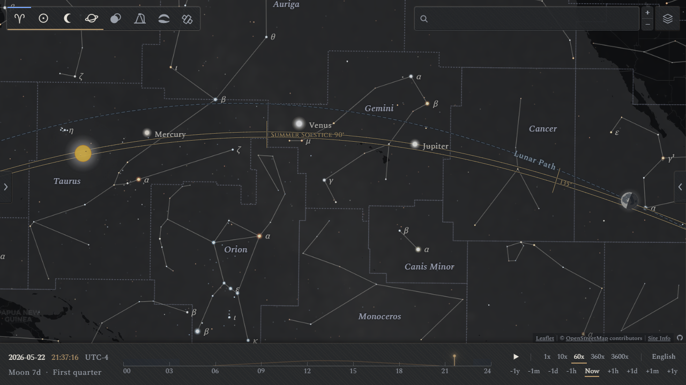
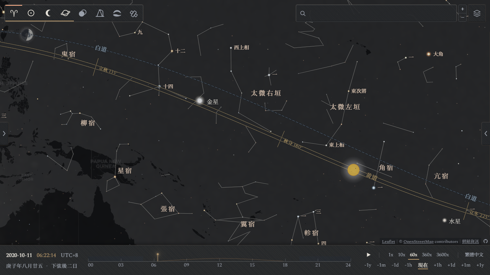
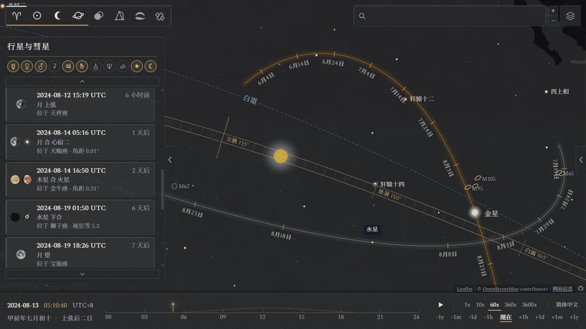

#  星下点地图

**简体中文** · [繁體中文](../zh-Hant/README.md) · [English](../en/README.md) · [Français](../fr/README.md) · [Español](../es/README.md) · [Italiano](../it/README.md) · [日本語](../ja/README.md)

<p align="center">
  
</p>

**网站链接**：https://higashimado.github.io/SubstellarAtlas/

星下点地图是以“星下点”为概念来源，将天球与地球表面相叠后制成的地图。在星下点地图中，每个天体都被投影到其星下点所对应的地理位置上，跟随地球以 23 时 56 分为周期缓慢旋转。天球与地球的交互，可以自然地展示各类天文事件在地球上的可见范围，例如昼夜更替、行星、彗星、深空天体、日月食、极光和人造卫星等。

## 概念设计

> 仲春春分，夕出郊奎、娄、胃东五舍，为齐；仲夏夏至，夕出郊东井、舆鬼、柳东七舍，为楚；仲秋秋分，夕出郊角、亢、氐、房东四舍，为汉；仲冬冬至，晨出郊东方，与尾、箕、斗、牵牛俱西，为中国。—— 《史记·天官书》

<p align="center">
  
</p>

天有列宿，地有州域。天空中的现象和地理上的区域之间的联系，是自天文学和占星学诞生之初就存在的概念：古代中国有二十八宿对九州郡国的“分野”之说，希腊-罗马的托勒密提出过黄道十二宫与国家的对应关系。尽管有“支离穿凿”的评价，但其展示的天文与地理之间的对称和同构，仍是后世诸多想象与思考的来源。

现代测地学为天球与地球给出了一种更严谨的对应关系：```lat = Dec, lon = RA − GMST```．︀具体地说，将天体沿垂线投影到地球上，落得的地表点便是唯一的、可精确计算的星下点。相对于静置的世界地图，被投影的星图有如下特点：

* 向西旋转：星图随天球自西向东以恒星日为周期旋转，与地球自身的自转方向恰好相反
* 东西反向：使用者从星图外侧向下观察，与地面观测者从星空内侧向上的视角东西反向
* 近大远小：天体呈现的是视觉大小而非真实大小，近处的月亮大小要远大于远处的行星

## 特色功能

### 图层说明

地图图层采用暗色主题，默认为 [CARTO Dark Matter](https://github.com/cartodb/basemap-styles)，通过右上角的图层选项可切换 [Stadia Alidade Smooth Dark](https://docs.stadiamaps.com/map-styles/alidade-smooth-dark/)．

左上角的图层选项可用于切换网站开发/集成的数据图层，目前共有：

| 类别 | 功能 |
|---|---|
| 星空/星座/星官 | 恒星、深空天体、银河、流星雨、星座/星官/星群、多语言标签、坐标参考线 |
| 太阳/月亮 | 盘面绘制、相位渲染、日光/月光蒙版 |
| 行星/彗星 | 盘面绘制、相位渲染、木卫/土卫、小行星、彗星、事件列表 |
| 日月食 | 事件列表、见食范围、食况信息与食况图 |
| 光污染 | 数据渲染（D.J. Lorenz） |
| 极光卵 | 数据渲染（NOAA SWPC OVATION） |
| 人造卫星 | 数据渲染（CelesTrak） |

### 观测者罗盘

观测者罗盘是为特定地点的用户提供天体方位参考的工具，使用者可通过双击地图上的任意地点触发并锁定。在相应图层打开后，锁定后的观测者罗盘能够显示：
- 日出、日落方向、太阳的当前方位及当日运行轨迹
- 月出、月落方向、月亮的当前方位及当日运行轨迹
- 全年的太阳运行轨迹范围
- 天空中可见行星的当前方位

单击罗盘中的图标或标签可显示相应的**方位射线**。罗盘出现时，单击天体星下点可显示该地点到星下点的大圆连线。右侧信息栏则提供了详细的地点信息，以及当日的日、月、行星观测数据，单击数据栏中的时间可跳转至对应时刻。

<p align="center">
  
</p>

### 日月光蒙版

在打开太阳、月亮图层时，日月光蒙版也随之自动打开。对于日光，蒙版以四层恒定的亮度叠加，分别对应白昼、民用曙光、航海曙光和天文曙光的可见范围。对于月光，蒙版的亮度则随月照亮度线性变化，满月时最亮，亏相时接近不可见。月食发生时，月光蒙版会随本影食分的大小而染上岩红色。右上角的图层选项提供了日月光蒙版的开关。

<p align="center">
  
</p>

### 天体版画

太阳、月亮、行星及部分彗星等可见盘面的天体在地图中以版画图标的形式展示，画风参考了英国光学仪器制造商兼制图师 [John Browning](https://en.wikipedia.org/wiki/John_Browning_(scientific_instrument_maker)) 在 1870 年发布于《皇家天文学会月报》上的版画插图。天体盘面在地图上所占的角度大小与其视直径严格一致，会随其相对地球的距离而发生变化。天体盘面上的阴影范围则按其相位角计算渲染。具体地，太阳系内天体在地图上的渲染大小与其视直径的对应关系为：

- 太阳与月亮的视直径最大约 0.53°，投影到地球表面约 60 km，相当于一座巨型城市
- 木星的视直径最大约 50″，投影到地球表面约 1 km，相当于一个大型社区
- 天王星的视直径最大约 4″，投影到地球表面约 80 m，相当于一座标准足球场


<p align="center">
  
</p>

### 天体轨迹

行星与彗星图层提供了合冲相关的天文事件列表，并附有和特定天体相关的筛选器，点击对应事件可跳转到事件发生时天体所处的对应位置。跳转后，行星或彗星在事件发生前后的运行轨迹将自动打开，并按照特定间隔显示其在不同日期所处的位置。点击天体轨迹上的时间标签可以跳转到对应时刻。当前，收录到事件列表的天体除了月球、行星以外，还有三颗较大的小行星（谷神星、智神星、灶神星）以及 2000–2025 年间发现的视星等可达 6 等以上的明亮彗星（如 [Tsuchinshan-ATLAS 彗星](https://zh.wikipedia.org/wiki/%E7%B4%AB%E9%87%91%E5%B1%B1-%E9%98%BF%E7%89%B9%E6%8B%89%E6%96%AF%E5%BD%97%E6%98%9F) 等）

<p align="center">
  
</p>

### 日月食交互

日月食发生时，地图上会展示预载入的可见范围包络曲线，以及实时计算的瞬时可见范围包络圈。拉开左侧信息栏可见 2000–2099 年的日月食列表，拉开右侧信息栏则可见选定地点上下一次可见日月食的信息，以及正在发生的可见日月食的食况详情。

<p align="center">
  
</p>

月食的食况图以**地影图**为背景，展示月亮穿过地球半影和本影的情况。日食的食况图则是事件期间太阳在天空中的**轨迹图**。食况图下方展示了极大时刻与各接触时刻，月亮或太阳的高度角和方位角。

<p align="center">
  
  &nbsp;&nbsp;&nbsp;&nbsp;&nbsp;&nbsp;&nbsp;&nbsp;
  
  <br>
</p>

### 极光卵/光污染/人造卫星

除天文图层外，本项目还集成了光污染、极光卵和人造卫星数据，并支持叠加展示。为避免信息干扰，部分图层间引入有冲突机制（例如，星座图层和光污染图层不可同时打开）。光污染图层和极光卵图层的颜色约定与数据源网站一致。卫星图层以铜绿色显示卫星轨迹，其中的金色段则是地面上可见卫星闪光的轨迹。右侧信息栏的光污染、极光和卫星板块则提供了详细的观测信息。极光卵和人造卫星数据均为近实时预测，数据超期后的图层会被锁定为灰色。

<p align="center">
  
</p>

## 数据集

### 日月食（2000–2099 年）

本项目以 [Astronomy Engine](https://github.com/cosinekitty/astronomy) 2.1.19 提供的太阳、月球位置矢量计算了 2000–2099 年间的 226 次日食和 228 次月食。数据集包含有用于计算日食事件接触时刻、位置的贝塞尔元素，以及表征整起事件食况范围的地面包络曲线（本影中心线、本影南北限、等食分线、半影南北线、日出/日落极大食线、日出日落圈等），月食数据集则仅含索引。

**注**：日食的实时阴影和食况范围以及月食的食况范围不在数据集范围内，其渲染是通过相同算法实时计算

**目录结构**

| 文件 | 内容 |
|---|---|
| [`data/eclipses/solar.json`](../data/eclipses/solar.json) | 日食索引 |
| [`data/eclipses/lunar.json`](../data/eclipses/lunar.json) | 月食索引 |
| [`data/eclipses/events/`](../data/eclipses/events/) `<date>.json` | 日食见食范围 |
| [`data/eclipses/README.md`](../data/eclipses/README.md) | 格式说明 |


### 中国传统星名

本项目提供以 HIP 为索引的多语言中国传统星名数据集，现收录 3035 条中国传统星名和 312 项星官条目。条目的来源主题为 [Stellarium](https://stellarium.org/) 社区提供的中国传统星名名录，部分补充条目参考自[余钊焕的个人网站](https://yzhxxzxy.github.io/cn/index.html)、[Guanjin0562](https://github.com/Guanjin0562/stellarium/tree/chinese-skyculture-enhancement) 及维基百科等众源资料。中国星官连线取自 d3-celestial 的星空数据。多语言翻译（含英语、法语、西班牙语、意大利语）提供了音译和意译两种译法。

<p align="center">
  
</p>

**目录结构**

| 文件 | 内容 |
|---|---|
| [`data/sky/names.cn.json`](../data/sky/names.cn.json) | 星官信息 |
| [`data/sky/lines.cn.geojson`](../data/sky/lines.cn.geojson) | 星官连线 |
| [`data/sky/i18n/`](../data/sky/i18n/) `<locale>/stars.json` | 中国传统星名及多语言翻译 |
| [`data/sky/i18n/`](../data/sky/i18n/) `<locale>/constellations.cn.json` | 中国星官名及多语言翻译 |


### 中国大陆地名

本项目的地名正反查询功能主要由 [GeoNames](https://www.geonames.org/) 提供的 cities15000 城市数据集支持。然而， cities15000 中的城市坐标及多语言名称多有缺失。为此，本项目在中国大陆地区增补了 [OSMChina-coverage](https://github.com/OSMChina/OSMChina-coverage) 中的 2023 年中国大陆乡镇列表，将其转换至 json 格式合并入 GeoNames 城市数据库中。此外，本项目还填补了 cities15000 中部分地名的中文翻译缺失，并在东亚地区保证了地名的中文/日文的双语互译。

<p align="center">
  
</p>

**目录结构**

| 文件 | 内容 |
|---|---|
| [`data/places/cities.json.gz`](../data/places/cities.json.gz) | 增补后地名库 |
| [`data/places/name-patches.json`](../data/places/name-patches.json) | 中文/日文补名 |

## 致谢和许可

本项目自有代码以 [**GNU General Public License v3.0**](../LICENSE) 发布，第三方代码、数据、字体依其许可。

| 用途 | 组件 (版本) | 作者 / 来源 | 许可 |
|---|---|---|---|
| 地图引擎 | [Leaflet](https://leafletjs.com/) 1.9.4 | Volodymyr Agafonkin | BSD-2-Clause |
| 地图瓦片 | [OpenStreetMap](https://www.openstreetmap.org/copyright) | OpenStreetMap 社区 | ODbL |
| 蒙版分割 | [Leaflet.Terminator](https://github.com/joergdietrich/Leaflet.Terminator) 1.1.0 | Jörg Dietrich | MIT |
| 天文计算 | [Astronomy Engine](https://github.com/cosinekitty/astronomy) 2.1.19 | Don Cross | MIT |
| 太阳计算 | [SunCalc](https://github.com/mourner/suncalc) 1.9.0 | Volodymyr Agafonkin | BSD-2-Clause |
| 农历历法 | [lunar-javascript](https://github.com/6tail/lunar-javascript) 1.7.7 | 6tail | MIT |
| 星座连线 | [d3-celestial](https://github.com/ofrohn/d3-celestial) | Olaf Frohn | BSD |
| 恒星数据 | [HYG 星表](https://www.astronexus.com/projects/hyg) | David Nash | CC BY-SA 4.0 |
| 恒星数据 | [Gaia DR3](https://www.cosmos.esa.int/gaia) | ESA / Gaia / DPAC | CC BY-NC 3.0 IGO |
| 中国传统星名 | [Stellarium](https://stellarium.org/) | Stellarium 社区 | CC BY-SA |
| 中国传统星名 | [Guanjin0562](https://github.com/Guanjin0562/stellarium/tree/chinese-skyculture-enhancement) | 观津邀月 | GPL-2.0 |
| 土星卫星轨道 | [TASS 1.7](https://ftp.imcce.fr/pub/ephem/satel/tass17/) | Vienne & Duriez / J. Gajdosik | MIT |
| 彗星 / 小行星 | [JPL](https://ssd.jpl.nasa.gov/) · [MPC](https://www.minorplanetcenter.net/) | JPL · MPC | 公有领域 |
| 深空天体 | [OpenNGC](https://github.com/mattiaverga/OpenNGC) | Mattia Verga | CC BY-SA 4.0 |
| 日月食 | [EclipseWise](https://www.eclipsewise.com/) | Fred Espenak | © Espenak |
| 光污染 | [光污染图集](https://djlorenz.github.io/astronomy/lp/) | David J. Lorenz | © Lorenz |
| 极光预报 | [NOAA SWPC](https://www.swpc.noaa.gov/) | NOAA | 公有领域 |
| 卫星轨道计算 | [satellite.js](https://github.com/shashwatak/satellite-js) 5.0.0 | Shashwat Kandadai | MIT |
| 卫星轨道根数 | [CelesTrak](https://celestrak.org/) | T. S. Kelso | 公有领域 |
| 地名检索 | [GeoNames](https://www.geonames.org/) | GeoNames | CC BY 4.0 |
| 中国大陆地名 | [OSMChina-coverage](https://github.com/OSMChina/OSMChina-coverage) | OSMChina | GPL-3.0 |
| 西文字体 | [Spectral](https://fonts.google.com/specimen/Spectral) | Production Type | OFL |
| CJK 字体 | [Source Han Serif](https://github.com/adobe-fonts/source-han-serif) | Adobe | OFL |
| 题铭字体 | [Cinzel](https://fonts.google.com/specimen/Cinzel) | Natanael Gama | OFL |
| 数据解压 | [Pako](https://github.com/nodeca/pako) 2.1.0 | Nodeca | MIT |
