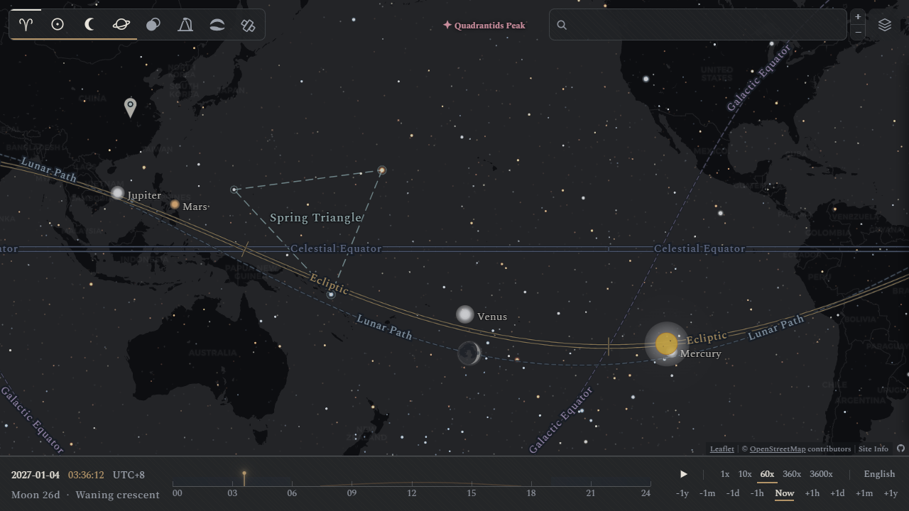
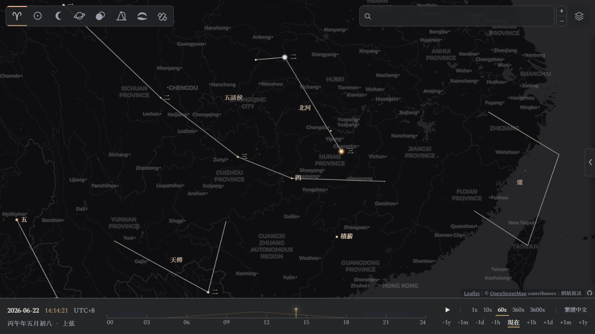
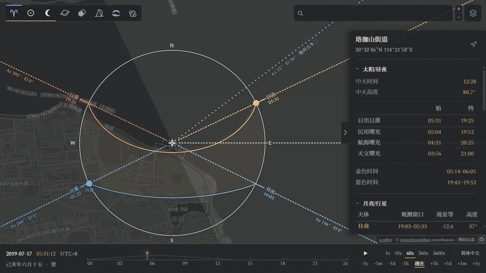
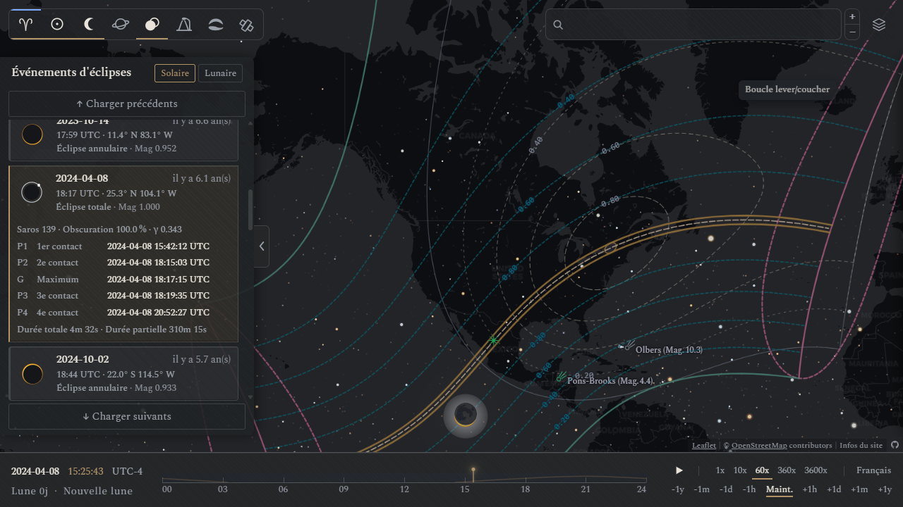
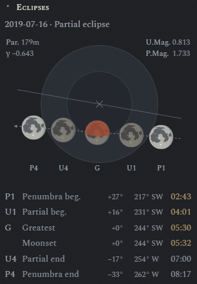
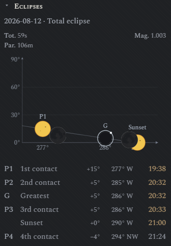
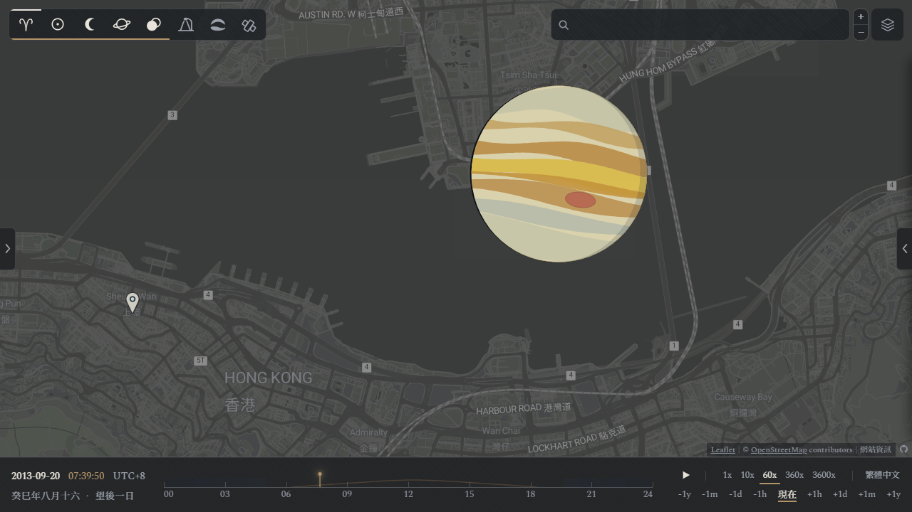
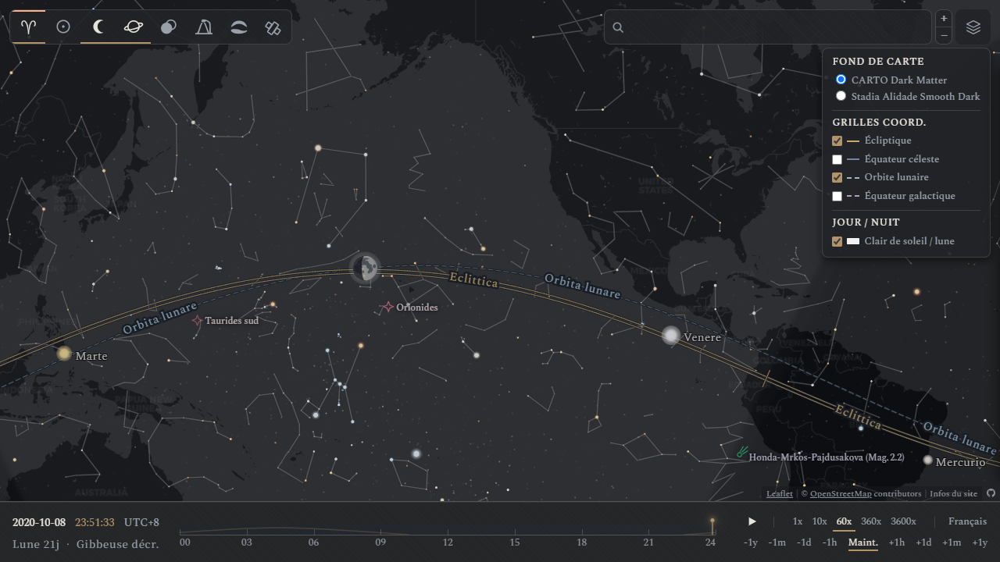
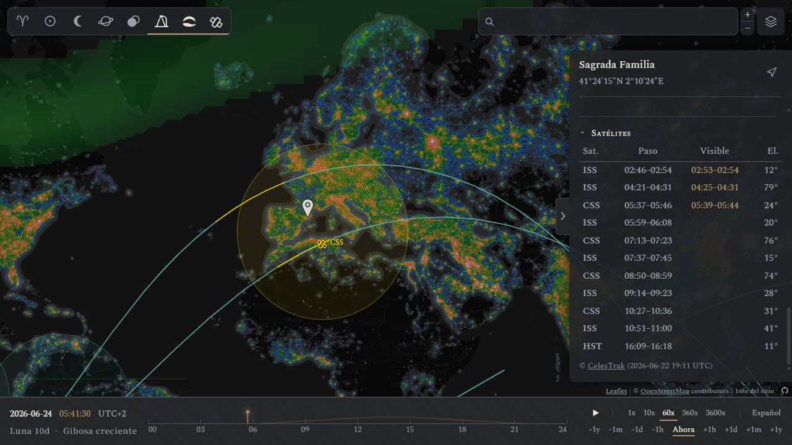

#  星下點地圖

[简体中文](../zh-Hans/README.md) · **繁體中文** · [English](../en/README.md) · [Français](../fr/README.md) · [Español](../es/README.md) · [Italiano](../it/README.md) · [日本語](../ja/README.md)

<p align="center">
  
</p>

星下點地圖是以「星下點」為概念來源，將天球與地球表面相疊後製成的地圖。在星下點地圖中，每個天體都被投影到其星下點所對應的地理位置上，跟隨地球以 23 時 56 分為週期緩慢旋轉。天球與地球的互動，可以自然地展示各類天文事件在地球上的可見範圍，例如晝夜、行星、深空天體、日月食、極光和人造衛星等。

## 概念設計

> 仲春春分，夕出郊奎、娄、胃东五舍，为齐；仲夏夏至，夕出郊东井、舆鬼、柳东七舍，为楚；仲秋秋分，夕出郊角、亢、氐、房东四舍，为汉；仲冬冬至，晨出郊东方，与尾、箕、斗、牵牛俱西，为中国。—— 《史记·天官书》

<p align="center">
  
</p>

天有列宿，地有州域。天空中的現象和地理上的區域之間的聯繫，是自天文學和占星學誕生之初就存在的概念：古代中國有二十八宿對九州郡國的「分野」之說，希臘-羅馬的托勒密提出過黃道十二宮與國家的對應關係。儘管有「支離穿鑿」的評價，但其展示的天文與地理之間的對稱和同構，仍是後世諸多想像與思考的來源。

現代測地學為天球與地球給出了一種更嚴謹的對應關係：```lat = Dec, lon = RA − GMST```．︀具體地說，將天體沿垂線投影到地球上，如此落得的地表點便是唯一的、可精確計算的星下點。相對於靜置的世界地圖，被投影下的星圖有如下特點：

* 向西旋轉：星圖隨天球自西向東以恆星日為週期旋轉，與地球自身的自轉方向恰好相反
* 東西反向：使用者從星圖外側向下觀察，與地面觀測者從星空內側向上的視角東西反向
* 近大遠小：天體呈現的是視覺大小而非真實大小，離地球較近的月亮的面積佔比要遠大於行星和深空天體

## 特色功能

### 圖層說明

地圖圖層採用暗色主題，預設為 [CARTO Dark Matter](https://github.com/cartodb/basemap-styles)，透過右上角的圖層選項可切換 [Stadia Alidade Smooth Dark](https://docs.stadiamaps.com/map-styles/alidade-smooth-dark/)．

左上角的圖層選項可用於切換網站開發/整合的數據圖層，目前共有：

| 類別 | 功能 |
|---|---|
| 星空/星座/星官 | 恆星、深空天體、流星雨、星座/星官/星群、多語言標籤、座標參考線 |
| 太陽/月亮/行星 | 盤面、相位渲染、日光/月光蒙版 |
| 日月食 | 事件列表、見食範圍、食況資訊與食況圖 |
| 光污染 | 數據渲染（D.J. Lorenz） |
| 極光卵 | 數據渲染（NOAA SWPC OVATION） |
| 人造衛星 | 數據渲染（CelesTrak） |

### 觀測者羅盤

觀測者羅盤是為特定地點的使用者提供天體方位參考的工具，使用者可透過雙擊地圖上的任意地點觸發並鎖定。在相應圖層開啟後，鎖定後的觀測者羅盤能夠顯示：
- 日出、日落方向、太陽的當前方位及當日運行軌跡
- 月出、月落方向、月亮的當前方位及當日運行軌跡
- 全年的太陽運行軌跡範圍
- 天空中可見行星的當前方位

單擊羅盤中的圖示或標籤可顯示對應的延長**方位射線**。羅盤出現時，單擊天體星下點可顯示該地點到星下點的大圓連線。右側資訊欄則提供了詳細的地點資訊，以及當日的日、月、行星觀測數據，單擊數據欄中的時間可跳轉至對應時刻。

<p align="center">
  
</p>

### 日月食互動

日月食發生時，地圖上會展示預載入的可見範圍包絡曲線，以及即時計算的瞬時可見範圍包絡圈。拉開左側資訊欄可見 2000–2049 年的日月食列表，拉開右側資訊欄則可見選定地點上下一次可見日月食的資訊，以及正在發生的可見日月食的食況詳情。

<p align="center">
  
</p>

月食的食況圖以**地影圖**為背景，展示月亮穿過地球半影和本影的情況。日食的食況圖則是事件期間太陽在天空中的**軌跡圖**。食況圖下方展示了極大時刻與各接觸時刻，月亮或太陽的高度角和方位角。

<p align="center">
  
  &nbsp;&nbsp;&nbsp;&nbsp;&nbsp;&nbsp;&nbsp;&nbsp;
  
  <br>
</p>

### 天體版畫

太陽、月亮和各行星等可見盤面的天體在地圖中以版畫圖示的形式展示，畫風參考了英國光學儀器製造商兼製圖師 [John Browning](https://en.wikipedia.org/wiki/John_Browning_(scientific_instrument_maker)) 在 1870 年發佈於《皇家天文學會月報》上的版畫插圖。天體盤面在地圖上所佔的角度大小與其視直徑嚴格一致，會隨其相對地球的距離而發生變化。天體盤面上的陰影範圍則按其相位角計算渲染。具體地，太陽系內天體在地圖上的渲染大小與其視直徑的對應關係為：

- 太陽與月亮的視直徑最大約 0.53°，投影到地球表面約 60 km，相當於一座巨型城市
- 木星的視直徑最大約 50″，投影到地球表面約 1 km，相當於一個大型社區
- 天王星的視直徑最大約 4″，投影到地球表面約 80 m，相當於一座標準足球場


<p align="center">
  
</p>

### 日月光蒙版

在開啟太陽、月亮圖層時，日月光蒙版也隨之自動開啟。對於日光，蒙版以四層恆定的亮度疊加，分別對應白晝、民用曙光、航海曙光和天文曙光的可見範圍。對於月光，蒙版的亮度則隨月照亮度線性變化，滿月時最亮，虧相時接近不可見。月食發生時，月光蒙版會隨本影食分的大小而染上岩紅色。右上角的圖層選項提供了日月光蒙版的開關。

<p align="center">
  
</p>

### 圖層疊加

除天文圖層外，本項目還整合了光污染、極光卵和人造衛星數據，並支援疊加展示。為避免資訊干擾，部分圖層間引入有衝突機制（例如，星座圖層和光污染圖層不可同時開啟）。光污染圖層和極光卵圖層的顏色約定與數據源網站一致。衛星圖層以銅綠色顯示衛星軌跡，其中的金色段則是地面上可見衛星閃光的軌跡。右側資訊欄的光污染、極光和衛星板塊則提供了詳細的觀測資訊。需要注意的是，極光卵和人造衛星數據均為近即時預測，數據超期後的圖層會被鎖定為灰色。

<p align="center">
  
</p>

## 數據集

### 日月食（2000–2049 年）

本項目以 [Astronomy Engine](https://github.com/cosinekitty/astronomy) 2.1.19 提供的太陽、月球位置向量計算了 2000–2049 年間的 112 次日食和 114 次月食。數據集包含有用於計算日食事件接觸時刻、位置的貝塞爾元素，以及表徵整起事件食況範圍的地面包絡曲線（本影中心線、本影南北限、等食分線、半影南北線、日出/日落極大食線、日出日落圈等），月食數據集則僅含索引。

**註**：日食的即時陰影和食況範圍以及月食的食況範圍不在數據集範圍內，其渲染是透過相同演算法即時計算

**目錄結構**

| 檔案 | 內容 |
|---|---|
| [`data/eclipses/solar.json`](../data/eclipses/solar.json) | 日食索引 |
| [`data/eclipses/lunar.json`](../data/eclipses/lunar.json) | 月食索引 |
| [`data/eclipses/events/`](../data/eclipses/events/) `<date>.json` | 日食見食範圍 |
| [`data/eclipses/README.md`](../data/eclipses/README.md) | 格式說明 |


### 中國傳統星名

本項目提供以 HIP 為索引的多語言中國傳統星名數據集，現收錄 3035 條中國傳統星名和 312 項星官條目。條目的來源主題為 [Stellarium](https://stellarium.org/) 社區提供的中國傳統星名名錄，部分補充條目參考自[余釗煥的個人網站](https://yzhxxzxy.github.io/cn/index.html)、[Guanjin0562](https://github.com/Guanjin0562/stellarium/tree/chinese-skyculture-enhancement) 及維基百科等眾源資料。中國星官連線取自 d3-celestial 的星空數據。多語言翻譯（含英語、法語、西班牙語、意大利語）提供了音譯和意譯兩種譯法。

**目錄結構**

| 檔案 | 內容 |
|---|---|
| [`data/sky/names.cn.json`](../data/sky/names.cn.json) | 星官資訊 |
| [`data/sky/lines.cn.geojson`](../data/sky/lines.cn.geojson) | 星官連線 |
| [`data/sky/i18n/`](../data/sky/i18n/) `<locale>/stars.json` | 中國傳統星名及多語言翻譯 |
| [`data/sky/i18n/`](../data/sky/i18n/) `<locale>/constellations.cn.json` | 中國星官名及多語言翻譯 |


### 中國大陸地名

本項目的地名正反查詢功能主要由 [GeoNames](https://www.geonames.org/) 提供的 cities15000 城市數據集支援。然而，cities15000 中的城市座標及多語言名稱多有缺失。為此，本項目在中國大陸地區增補了 [OSMChina-coverage](https://github.com/OSMChina/OSMChina-coverage) 中的 2023 年中國大陸鄉鎮列表，將其轉換至 json 格式合併入 GeoNames 城市數據庫中。此外，本項目還填補了 cities15000 中部分地名的中文翻譯缺失，並在東亞地區保證了地名的中文/日文的雙語互譯。

| 檔案 | 內容 |
|---|---|
| [`data/places/cities.json.gz`](../data/places/cities.json.gz) | 增補後地名庫 |
| [`data/places/name-patches.json`](../data/places/name-patches.json) | 中文/日文補名 |

## 致謝與授權

本項目自有程式碼以 [**GNU General Public License v3.0**](../LICENSE) 發佈，第三方程式碼、數據、字型依其授權。

| 用途 | 組件 (版本) | 作者 / 來源 | 授權 |
|---|---|---|---|
| 地圖引擎 | [Leaflet](https://leafletjs.com/) 1.9.4 | Volodymyr Agafonkin | BSD-2-Clause |
| 地圖圖磚 | [OpenStreetMap](https://www.openstreetmap.org/copyright) | OpenStreetMap 社區 | ODbL |
| 蒙版分割 | [Leaflet.Terminator](https://github.com/joergdietrich/Leaflet.Terminator) 1.1.0 | Jörg Dietrich | MIT |
| 天文計算 | [Astronomy Engine](https://github.com/cosinekitty/astronomy) 2.1.19 | Don Cross | MIT |
| 太陽計算 | [SunCalc](https://github.com/mourner/suncalc) 1.9.0 | Volodymyr Agafonkin | BSD-2-Clause |
| 農曆曆法 | [lunar-javascript](https://github.com/6tail/lunar-javascript) 1.7.7 | 6tail | MIT |
| 星座連線 | [d3-celestial](https://github.com/ofrohn/d3-celestial) | Olaf Frohn | BSD |
| 恆星數據 | [HYG 星表](https://www.astronexus.com/projects/hyg) | David Nash | CC BY-SA 4.0 |
| 中國傳統星名 | [Stellarium](https://stellarium.org/) | Stellarium 社區 | CC BY-SA |
| 中國傳統星名 | [Guanjin0562](https://github.com/Guanjin0562/stellarium/tree/chinese-skyculture-enhancement) | 觀津邀月 | GPL-2.0 |
| 彗星 / 小行星 | [JPL](https://ssd.jpl.nasa.gov/) · [MPC](https://www.minorplanetcenter.net/) | JPL · MPC | 公有領域 |
| 深空天體 | [OpenNGC](https://github.com/mattiaverga/OpenNGC) | Mattia Verga | CC BY-SA 4.0 |
| 日月食 | [EclipseWise](https://www.eclipsewise.com/) | Fred Espenak | © Espenak |
| 光污染 | [光污染圖集](https://djlorenz.github.io/astronomy/lp/) | David J. Lorenz | © Lorenz |
| 極光預報 | [NOAA SWPC](https://www.swpc.noaa.gov/) | NOAA | 公有領域 |
| 衛星軌道計算 | [satellite.js](https://github.com/shashwatak/satellite-js) 5.0.0 | Shashwat Kandadai | MIT |
| 衛星軌道根數 | [CelesTrak](https://celestrak.org/) | T. S. Kelso | 公有領域 |
| 地名檢索 | [GeoNames](https://www.geonames.org/) | GeoNames | CC BY 4.0 |
| 中國大陸地名 | [OSMChina-coverage](https://github.com/OSMChina/OSMChina-coverage) | OSMChina | GPL-3.0 |
| 西文字型 | [Source Serif](https://github.com/adobe-fonts/source-serif) | Adobe | OFL |
| CJK 字型 | [Source Han Serif](https://github.com/adobe-fonts/source-han-serif) | Adobe | OFL |
| 數據解壓縮 | [Pako](https://github.com/nodeca/pako) 2.1.0 | Nodeca | MIT |
